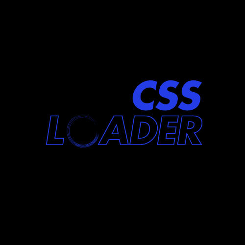

# Spinner Generator

Create beautiful, customizable CSS loading spinners with a live preview and instant code export. All spinners are pure HTML5 & CSS3—no JavaScript required for the generated loaders.

## Features

- **Live Preview:** Instantly see your spinner as you customize it.
- **Customizable:** Adjust type, size, speed, colors, and stroke width.
- **Code Export:** Copy ready-to-use HTML and CSS for your projects.
- **Framework Agnostic:** Works everywhere—just copy and paste.

## Demo



## Tech Stack

- [React](https://react.dev/)
- [TypeScript](https://www.typescriptlang.org/)
- [Vite](https://vitejs.dev/)
- [Tailwind CSS](https://tailwindcss.com/)
- [shadcn/ui](https://ui.shadcn.com/)

## Getting Started

### Prerequisites

- [Node.js](https://nodejs.org/) (v18+ recommended)
- [npm](https://www.npmjs.com/) or [bun](https://bun.sh/)

### Installation

```sh
git clone <YOUR_GIT_URL>
cd <YOUR_PROJECT_NAME>
npm install
```

### Development

```sh
npm run dev
```

Open [http://localhost:5173](http://localhost:5173) to view the app in your browser.

### Build for Production

```sh
npm run build
```

### Preview Production Build

```sh
npm run preview
```

## Project Structure

- `src/pages/Index.tsx` – Main page with spinner controls, preview, and code export
- `src/components/` – UI components
- `public/` – Static assets (including the CSS logo)

## Contributing

Pull requests are welcome! For major changes, please open an issue first to discuss what you would like to change.

## License

[MIT](LICENSE) (add a LICENSE file if you want to specify this)
